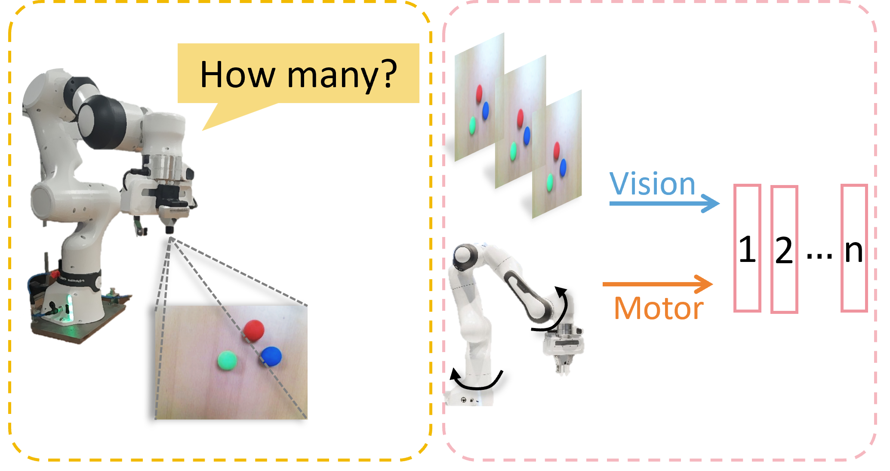

# Multi_scale_vision

This project studies embodied counting with multimodal sequential learning.
The core question is: how should visual observations and robot joint signals be integrated over time so that a model learns counting more efficiently and robustly?

## Project Overview

We compare five model families, from single-modality baselines to multimodal fusion strategies:

1. E0 Joint-only
2. E1 Visual-only
3. E2 Early fusion
4. E3 Late fusion
5. E4 Stepwise fusion (proposed)

Rather than focusing only on final converged scores, this project emphasizes learning dynamics: convergence speed, intermediate-epoch performance, and temporal prediction behavior.

## Figure 1: Experimental Setup



This figure presents the embodied data-collection setup and a general view of the task pipeline.

## Figure 2: Model Architecture Comparison



This figure compares the five model designs and highlights the difference between early/late/stepwise multimodal interaction.

## Main Research Message

The experiments support a clear trend:

1. Multimodal models outperform single-modality baselines during training.
2. Dual-stream temporal modeling improves representation quality.
3. Stepwise fusion shows a stronger early-to-mid training advantage, even when several models become close at convergence.

In short, temporal structure of fusion matters for optimization and practical learnability.

## Repository at a Glance

- `trainer.py`: training pipeline
- `evaluate.py`: aggregate experiment metrics
- `visualize_results.py`: paper figures from aggregated outputs
- `visualize_checkpoint_samples.py`: epoch-based trajectory and sample analysis
- `summarize_epoch_metrics.py`: fixed-epoch metric summary
- `generate_paper_figures.py`: one-shot regeneration for paper tables/figures

## Quick Start

Run a full paper-oriented regeneration (from existing experiment outputs):

```bash
python generate_paper_figures.py --experiments_root ./experiments --results_dir ./results
```

Or submit on cluster:

```bash
sbatch script/run_generate_paper_figures.sh
```

## Outputs

Generated artifacts are saved in `results/`, including:

- aggregated tables (e.g., `main_table.csv`, `epoch_metrics_summary.csv`)
- comparison plots and learning curves
- epoch-based confusion matrices and trajectory visualizations

These files are directly used in the paper.
